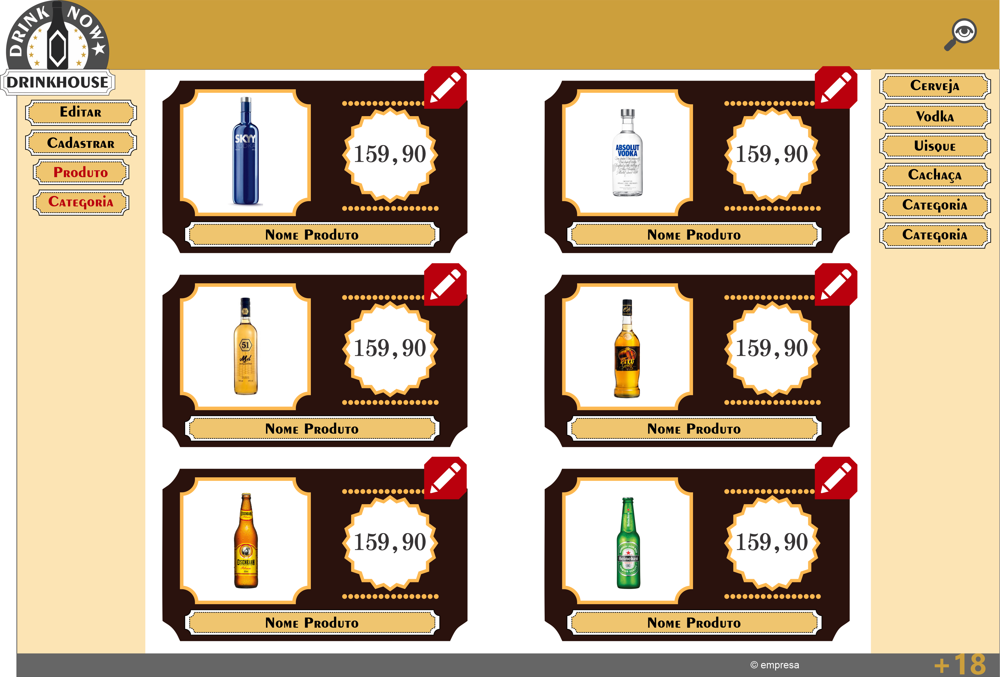
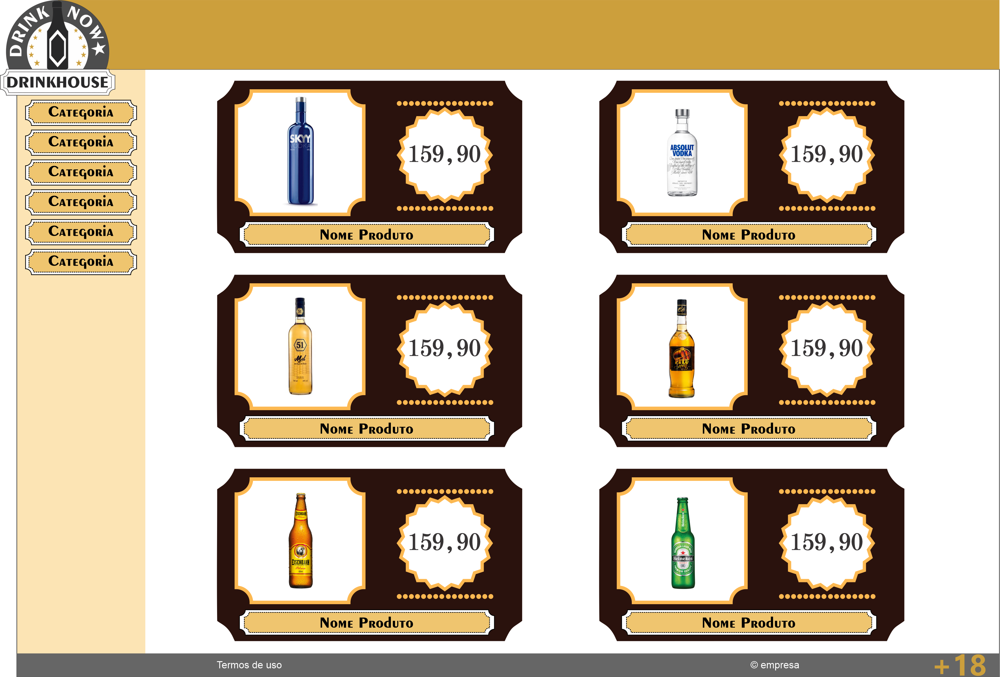

# Point Da Bebida

## Usuário Administrador 

### Funcionalidade Backend

* Cadastrar Bebidas
* Cadastrar Categoria
* Editar Bebidas
* Editar Categoria
* Deletar Bebidas 
* Deletar Categoria

### Funcionalidade Frontend : Telas

* Editar/deletar produtos/listar produtos
* Editar/deletar categoria/listar categoria e mostrar quantos produtos tem relacionado a categoria 
* Cadastro de produtos/categoria

## Usuário Visitante

### Funcionalidade Backend

* Listagem de produtos
* Listagem de produtos por categoria
* Pesquisar produto por nome

### Funcionalidade Frontend : Telas

* Listagem de produtos, com filtragens por nome ou/e categoria

### Criando Primeiro protótipo da tela de admin(Usando coreldraw)

  

### Criando Primeiro protótipo da tela de visitante(Usando coreldraw)

  

